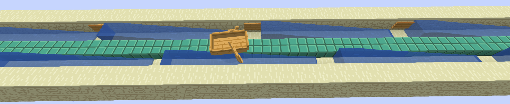

# Lightspeed Boat

[Download me on Modrinth](https://modrinth.com/mod/lightspeed-boat), or [sponsor the developer](https://afdian.net/a/yezhiyi9670) if you like this project.

The cool way to travel fast, now in Minecraft™ Java Edition!

## Summary

Lightspeed boat is originally a ~~bug~~ feature in Bedrock Edition, where boats receives no friction when on slabs. This allows for accelerating boats to enourmously high speeds using flowing water. (Note: It is now half-fixed in Bedrock Edition)

This mod brings the feature to Java Edition. Enjoy cool automatable fast travel systems!

The figure above is an available design for accelerating boats. [Read more about Lightspeed Boat on Minecraft Wiki](https://minecraft.fandom.com/zh/wiki/%E6%95%99%E7%A8%8B/%E5%85%89%E9%80%9F%E8%88%B9).

**WARNING: This mod must be present on both server and client, otherwise some server-client desync can occur.**

Note: By default, the mod has a protective measure that prevent the speed from exceeding 72.73m/s (the blue ice speed).

## Details

Here are the mechanical details of the mod.

The boat will enter lightspeed state, if it has a velocity greater than `lightspeedThershold` 2.4 (in m/s), and one of the following is satisfied:

- The boat's Y coord substracted by the floor of itself is between `slabHeightMin` 0.4999 and `slabHeightMax` 0.5241. The boat must be either IN_WATER or ON_LAND. The block the boat is on cannot be Water or Bubble Column. (This requires the boat to be on a slab)
- The boat's bounding box's maxY is integer, and the Y velocity of the boat is near zero. (This requires the use of Soul Sand Bubble Columns and Trapdoors)

If `requireLevitating` is enabled, the first condition will be disabled.

When under lightspeed state:

- The drag (horizontal velocity decay) will be constantly `lightspeedDrag` 0, unless the speed exceeds `maxLightspeed` 72.73.
- If `allowPlayerDrive` is false, the player will not be able to drive the boat, but can still turn it.
- If `allowPlayerTurn` is false, the player will not be able to turn the boat.

Values can be customized by editing the `config/lightspeedboat-common.json` file.
